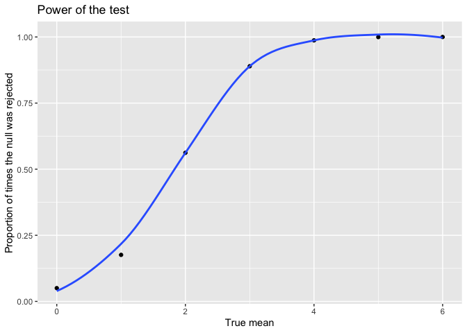
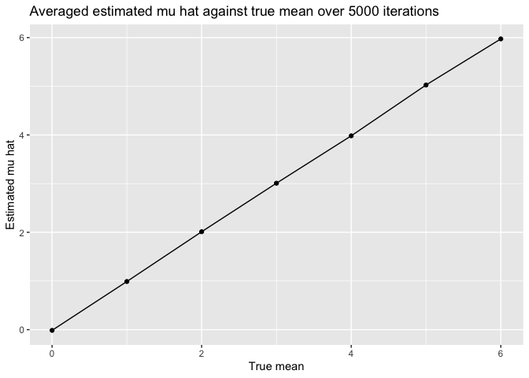

Homework 5
================
My An Huynh
2024-11-05

``` r
sim_data = 
  tibble(
    x = rnorm(n = 30, mean = 0, sd = 5)
  ) 

mu_hat = 
  sim_data |> 
  summarize(
    mu_hat = mean(x)
  )

result = 
  t.test(sim_data[["x"]], mu = 0, alternative = "two.sided", conf.level = 0.95) |> 
  broom::tidy() |> 
  bind_cols(mu_hat) |> 
  select(mu_hat, p.value) |> 
  mutate(
    reject_null = ifelse(p.value < 0.05, 1, 0)
  )
```

Create a function for x

``` r
sim_function = function(true_mean) {
  sim_data = 
    tibble(
      x = rnorm(n = 30, mean = true_mean, sd = 5)
    ) 

  mu_hat = 
    sim_data |> 
    summarize(
      mu_hat = mean(x)
    )

  result = 
    t.test(sim_data[["x"]], mu = 0, alternative = "two.sided", conf.level = 0.95) |> 
    broom::tidy() |> 
    bind_cols(mu_hat) |> 
    select(mu_hat, p.value) |> 
    mutate(
      reject_null = ifelse(p.value < 0.05, 1, 0)
    )
  return(result)
  
}

sim_function(true_mean = 2)
```

    ## # A tibble: 1 × 3
    ##   mu_hat p.value reject_null
    ##    <dbl>   <dbl>       <dbl>
    ## 1   1.53  0.0231           1

Iterate this 5000 times

``` r
sim_res = 
  expand_grid(
    true_mean = c(0,1,2,3,4,5,6),
    i = 1:5000
  ) |> 
  mutate(
    samp_res = map(true_mean, sim_function)
  ) |> 
  unnest(samp_res)
```

Make plot 1

``` r
plot1 = 
  sim_res |> 
  group_by(true_mean) |> 
  summarize(
    prop_reject = mean(reject_null)
  ) |> 
  ungroup() |> 
  ggplot(aes(x = true_mean, y = prop_reject)) + 
  geom_point() +
  geom_smooth(se = FALSE) +
  labs(
    title = "Power of the test",
    x = "True mean",
    y = "Proportion of times the null was rejected"
  )

print(plot1)
```

    ## `geom_smooth()` using method = 'loess' and formula = 'y ~ x'

<!-- -->

Make plot 2 Make a plot showing the average estimate of 𝜇̂ on the y axis
and the true value of 𝜇 on the x axis. Make a second plot (or overlay on
the first) the average estimate of 𝜇̂ only in samples for which the null
was rejected on the y axis and the true value of 𝜇 on the x axis. Is the
sample average of 𝜇̂ across tests for which the null is rejected
approximately equal to the true value of 𝜇 ? Why or why not?

``` r
plot2 =
  sim_res |> 
  group_by(true_mean) |> 
  summarize(
    average_mu_hat = mean(mu_hat)
  ) |> 
  ggplot(aes(x = true_mean, y = average_mu_hat)) +
  geom_point() +
  geom_line() +
  labs(
    title = "Averaged estimated mu hat against true mean over 5000 iterations",
    x = "True mean", 
    y = "Estimated mu hat"
  )

print(plot2)
```

<!-- -->

``` r
plot3 = 
  sim_res |> 
  filter(reject_null == "1") |> 
  group_by(true_mean) |> 
  summarize(
    average_mu_reject = mean(mu_hat)
  ) |> 
  ggplot(aes(x = true_mean, y = average_mu_reject)) +
  geom_point() +
  geom_line()

print(plot3)
```

<!-- -->
