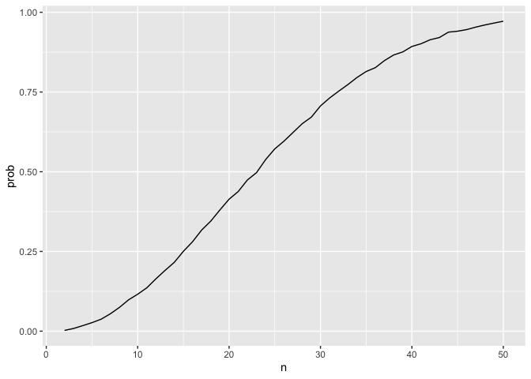

Homework 5
================
My An Huynh
2024-11-05

## Problem 1

## Birthday problem

Let’s put people in a room. Replace = TRUE mean more than 1 person can
have the same birthday

``` r
bday_sim = function(n) {

  bdays = sample(1:365, size = n, replace = TRUE)

  duplicate = length(unique(bdays)) < n
  
  return(duplicate)

}


bday_sim(50)
```

    ## [1] TRUE

run this a lot

``` r
sim_res = 
  expand_grid(
    n = 2:50,
    iter = 1:10000
  ) |> 
  mutate(result = map_lgl(n, bday_sim)) |> 
  group_by(n) |> 
  summarize(prob = mean(result))

sim_res |> 
  ggplot(aes(x = n, y = prob))+
  geom_line()
```

<!-- -->

## Problem 2

``` r
sim_data = 
  tibble(
    x = rnorm(n = 30, mean = 0, sd = 5)
  ) 

mu_hat = 
  sim_data |> 
  summarize(
    mu_hat = mean(x)
  )

result = 
  t.test(sim_data[["x"]], mu = 0, alternative = "two.sided", conf.level = 0.95) |> 
  broom::tidy() |> 
  bind_cols(mu_hat) |> 
  select(mu_hat, p.value) |> 
  mutate(
    reject_null = ifelse(p.value < 0.05, 1, 0)
  )
```

Create a function for x.

``` r
sim_function = function(true_mean) {
  sim_data = 
    tibble(
      x = rnorm(n = 30, mean = true_mean, sd = 5)
    ) 

  mu_hat = 
    sim_data |> 
    summarize(
      mu_hat = mean(x)
    )

  result = 
    t.test(sim_data[["x"]], mu = 0, alternative = "two.sided", conf.level = 0.95) |> 
    broom::tidy() |> 
    bind_cols(mu_hat) |> 
    select(mu_hat, p.value) |> 
    mutate(
      reject_null = ifelse(p.value < 0.05, 1, 0)
    )
  return(result)
  
}

sim_function(true_mean = 2)
```

    ## # A tibble: 1 × 3
    ##   mu_hat p.value reject_null
    ##    <dbl>   <dbl>       <dbl>
    ## 1   2.36  0.0301           1

Iterate this 5000 times.

``` r
sim_res = 
  expand_grid(
    true_mean = c(0,1,2,3,4,5,6),
    i = 1:5000
  ) |> 
  mutate(
    samp_res = map(true_mean, sim_function)
  ) |> 
  unnest(samp_res)
```

Plot of power against effect size.

``` r
plot1 = 
  sim_res |> 
  group_by(true_mean) |> 
  summarize(
    prop_reject = mean(reject_null)
  ) |> 
  ungroup() |> 
  ggplot(aes(x = true_mean, y = prop_reject)) + 
  geom_point() +
  geom_smooth(se = FALSE) +
  labs(
    title = "Power of the test",
    x = "True mean",
    y = "Proportion of times the null was rejected"
  )

print(plot1)
```

    ## `geom_smooth()` using method = 'loess' and formula = 'y ~ x'

<!-- -->

As the true mean deviates more from the null, which states that the true
mean equals 0, the power of the test increases. In other words, as
effect size increases, the power of the test increases. This
relationship is not linear but resembles the shape of a sigmoid curve.
The power gradually increases for smaller effect sizes, and rapidly
increases as effective size increases and plateaus when power reaches 1.

``` r
plot2 =
  sim_res |> 
  group_by(true_mean) |> 
  summarize(
    average_mu_hat = mean(mu_hat)
  ) 

plot3 = 
  sim_res |> 
  filter(reject_null == "1") |> 
  group_by(true_mean) |> 
  summarize(
    average_mu_reject = mean(mu_hat)
  ) 

combined_plot =
  left_join(plot2, plot3, by = "true_mean") |> 
  ggplot(aes(x = true_mean)) +
  geom_point(aes(y = average_mu_hat), color = "red") +
  geom_line(aes(y = average_mu_hat), color = "red") +
  geom_point(aes(y = average_mu_reject), color = "blue") +
  geom_line(aes(y = average_mu_reject), color = "blue") +
  labs(
    title = "Average mu_hat and average mu_rejected against true mean",
    x = "True Mean", 
    y = "Average mu_hat (red) / Average mu_rejected (blue)"
  )

print(combined_plot)
```

<!-- -->

Based on simulation data,

## Problem 3

The homicide data provides data on number of homicides, in 50 large
cities in the U.S. The dataset contains 11 variables and 52179
observations and spans from 2010 to 2017. The important variables are
`uid` (victim unique identifier), `reported_date` starting from 2010 to
2017, `victim_race`, `victim_age`, `victim_sex`, `lat` & `lon` (location
latitude and longitude), `disposition` - “Closed without arrest”,
“Closed barrest”, and “Open/No arrest”, `city` and `state`.

After inspecting the raw data, I noticed that “Tulsa, AL” is supposed to
be “Tulsa, OK”. This has been recoded in the data cleaning step.

``` r
homicide_df = 
  read_csv("data/homicide-data.csv") |> 
  mutate(
    city_state = paste(city, state, sep = ", ")
  ) |> 
  select(-city, -state) |> 
  mutate(city_state = recode(city_state, "Tulsa, AL" = "Tulsa, OK"))
```

    ## Rows: 52179 Columns: 12
    ## ── Column specification ────────────────────────────────────────────────────────
    ## Delimiter: ","
    ## chr (9): uid, victim_last, victim_first, victim_race, victim_age, victim_sex...
    ## dbl (3): reported_date, lat, lon
    ## 
    ## ℹ Use `spec()` to retrieve the full column specification for this data.
    ## ℹ Specify the column types or set `show_col_types = FALSE` to quiet this message.

``` r
homicide_summary = 
  homicide_df |> 
  group_by(city_state) |> 
  summarize(
    total_homicides = length(disposition),
    unsolved_homicides = sum(disposition %in% c("Closed without arrest", "Open/No arrest"))
  ) 
  
baltimore_unsolved = 
  homicide_summary |> 
  filter(city_state == "Baltimore, MD") 

baltimore_prop = 
  prop.test(baltimore_unsolved[["unsolved_homicides"]], baltimore_unsolved[["total_homicides"]]) |> 
  broom::tidy() |> 
  select(estimate, conf.low, conf.high)
```

Do this for every city

``` r
 homicide_summary = 
  homicide_df |> 
  group_by(city_state) |> 
  summarize(
    total_homicides = length(disposition),
    unsolved_homicides = sum(disposition %in% c("Closed without arrest", "Open/No arrest")),
    .groups = "drop"
  ) 
  
homicide_listcol = 
  homicide_summary |> 
  mutate(
    homicide_data = map2(unsolved_homicides, total_homicides, ~ c(.x, .y))
  )

prop_results = 
  homicide_listcol |> 
  mutate(
    prop_test_result = map(homicide_data, ~prop.test(.x[1], .x[2]))
  ) |> 
  mutate(
    prop_test_result = map(prop_test_result, broom::tidy)
  ) |> 
  unnest(prop_test_result) |> 
  select(city_state, estimate, conf.low, conf.high)
```

Make a plot showing the estimated proportion of unsolved homicides with
error bars

``` r
homicide_plot = 
  prop_results |> 
  ggplot(aes(x = reorder(city_state, estimate), y = estimate)) +
  geom_point() + 
  geom_errorbar(aes(ymin = conf.low, ymax = conf.high)) +
  theme(axis.text.x = element_text(angle = 90, hjust = 1)) +
  labs(
    title = "Proportion of Homicides in 50 Large City in The U.S",
    x = "City/State",
    y = "Proportion of Homicides"
  )

print(homicide_plot)
```

<!-- -->
